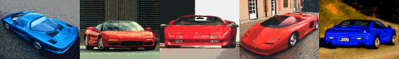

# Test-Drive-3-Maps

Reverse engineered and extracted maps of the DOS Game *Test Drive III: The Passion* by Accolade



# **[Online Viewer](https://s-macke.github.io/Test-Drive-3-Maps/)**
# **[Extracted Images Gallery](images/README.md)**

Wavefront Object files are available in the objs directory.

## Development

### Prerequisites
- Node.js 18+

### Installation
```bash
npm install
```

### Running the Browser Viewer
```bash
npm run dev
```
Opens the viewer at http://localhost:5173

### Building for Production
```bash
npm run build
```
Output is in the `dist/` directory.

### Exporting OBJ Files
```bash
npm run export
```
Exports all maps and objects to the `objs/` directory.

### Exporting PNG Images
```bash
npm run imgextract
```
Exports the currently documented DAT images as indexed-color PNGs to the `images/` directory.

### Exporting Scene Sprites
```bash
npm run spriteextract
```
Extracts transparent scene-sprite PNGs from the known scene render descriptor banks, including the `SCENE02` same-family variant.

### CLI Tools
```bash
# View LST file contents
npm run lstview -- public/base/SCENE01.LST

# Extract VGA image from DAT file
npm run imgview -- public/base/DATAB.DAT 0x151 12083 320
```

## Project Structure

```
src/
├── browser/     # Browser-only modules (Three.js viewer)
├── shared/      # Shared modules (extraction logic, LZW/RLE decoders)
└── tools/       # Node.js CLI tools
    ├── export/      # OBJ exporter
    ├── spriteextract/ # Scene sprite extractor
    ├── lstviewer/   # LST file viewer
    └── imgviewer/   # VGA image extractor
public/
└── base/        # Game data files (required)
objs/            # Exported Wavefront OBJ files
images/          # Extracted VGA images (PNG format)
spec/            # File format specifications
```

## Extracted Images Gallery

For a visual overview and previews of all extracted UI assets, scene sprites, map palettes, and car designs, visit the **[Project Images Gallery Index](images/README.md)**. Each individual directory contains its own generated visual gallery:
- [📁 Corvette ZR-1 Asset Gallery](images/CCERV/README.md)
- [📁 Honda NSX Asset Gallery](images/CCNSX/README.md)
- [📁 Lamborghini Diablo Asset Gallery](images/CDIAB/README.md)
- [📁 Mythos Asset Gallery](images/CMYTH/README.md)
- [📁 Chevrolet Corvette Stelvio Asset Gallery](images/CSTEL/README.md)
- [📁 Scenery Sprites Galleries](images/SCENE01_SPRITES/README.md)


## File Format Specifications

The `spec/` directory contains reverse-engineered documentation for Test Drive III file formats:

| File | Description |
|------|-------------|
| [3d-object-format.md](spec/3d-object-format.md) | 3D polygon/vertex format used in tiles and objects |
| [dat-file-layouts.md](spec/dat-file-layouts.md) | DAT file offset tables and resource layouts |
| [scene-render-descriptor-bank-format.md](spec/scene-render-descriptor-bank-format.md) | Scene render descriptor bank family used by `SCENE01.DAT`, `SCENE02.DAT`, and `SCENETT1.DAT` |
| [lst-file-format.md](spec/lst-file-format.md) | LST resource index files (scene and car variants) |
| [image-format.md](spec/image-format.md) | VGA image compression (LZW + RLE pipeline) |
