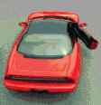
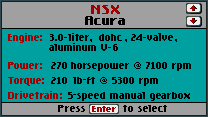
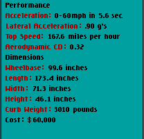

# Images in `CCNSX`

This directory contains **12** images, totaling **48.4 KB**.

[« Back to Images Index](../README.md)

## Image Gallery

|  Preview  |  Preview  |  Preview  |
|  :---:  |  :---:  |  :---:  |
| **CCNSX.BIC.png**  ` 112×83 ` ` 4.4 KB ` | **CCNSX.ETC.png**  ` 56×72 ` ` 1.7 KB ` | **CCNSX.ICN.png**  ` 208×83 ` ` 6.8 KB ` |
| **CCNSX.SIC.png**  ` 72×40 ` ` 1.6 KB ` | **CCNSX.SID.png**  ` 112×116 ` ` 4.8 KB ` | **CCNSX.TOP.png**  ` 320×16 ` ` 2 KB ` |
| **CCNSX1.BOT.png**  ` 320×44 ` ` 6.4 KB ` | **CCNSX2.BOT.png**  ` 320×44 ` ` 7.1 KB ` | **CCNSXFL1.LZ.png**  ` 208×117 ` ` 2.2 KB ` |
| **CCNSXFL2.LZ.png**  ` 208×200 ` ` 2.4 KB ` | **CCNSXL.BOT.png**  ` 168×48 ` ` 4.5 KB ` | **CCNSXR.BOT.png**  ` 168×48 ` ` 4.5 KB ` |

---
*Generated automatically by Antigravity AI on 2026-05-23.*
