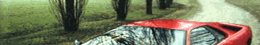
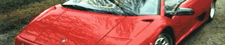
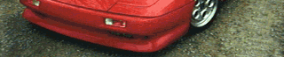
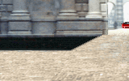
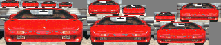
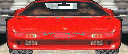
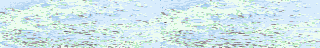

# Images in `DATAA`

This directory contains **16** images, totaling **107 KB**.

[« Back to Images Index](../README.md)

## Image Gallery

|  Preview  |  Preview  |
|  :---:  |  :---:  |
| **ACCO.LZ.png**  ` 320×200 ` ` 3.1 KB ` | **BROKE.LZ.png**  ` 320×96 ` ` 7.7 KB ` |
| **BROKEGA.LZ.png**  ` 320×96 ` ` 5.6 KB ` | **CHASE.LZ.png**  ` 496×32 ` ` 1.5 KB ` |
| **COMPASS.LZ.png**  ` 152×8 ` ` 984 B ` | **CREDITA.LZ.png**  ` 320×56 ` ` 10.9 KB ` |
| **CREDITB.LZ.png**  ` 320×65 ` ` 11.9 KB ` | **CREDITC.LZ.png**  ` 320×65 ` ` 10.9 KB ` |
| **TITLE1.LZ.png**  ` 160×100 ` ` 9.6 KB ` | **TITLE2.LZ.png**  ` 160×100 ` ` 7.6 KB ` |
| **TITLEANI.LZ.png**  ` 320×66 ` ` 12 KB ` | **TITLECAR.LZ.png**  ` 128×54 ` ` 4.8 KB ` |
| **TITLEL2.LZ.png**  ` 256×19 ` ` 2.6 KB ` | **TITLELET.LZ.png**  ` 240×69 ` ` 8.3 KB ` |
| **WATER.LZ.png**  ` 320×48 ` ` 5.1 KB ` | **WATEREGA.LZ.png**  ` 320×48 ` ` 4.3 KB ` |

---
*Generated automatically by Antigravity AI on 2026-05-23.*
