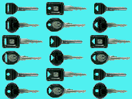
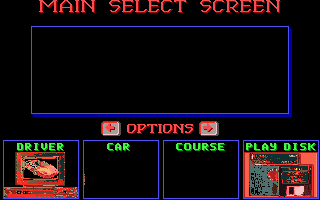
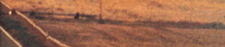
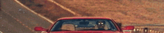
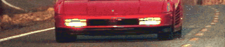

# Images in `DATAB`

This directory contains **12** images, totaling **95.5 KB**.

[« Back to Images Index](../README.md)

## Image Gallery

|  Preview  |  Preview  |
|  :---:  |  :---:  |
| **COPA.LZ.png**  ` 320×100 ` ` 10.2 KB ` | **COPB.LZ.png**  ` 320×58 ` ` 9.3 KB ` |
| **COPSEQ.LZ.png**  ` 128×90 ` ` 2.2 KB ` | **DIFFLEVA.LZ.png**  ` 320×56 ` ` 11.1 KB ` |
| **DIFFLEVB.LZ.png**  ` 320×65 ` ` 10.7 KB ` | **DIFFLEVC.LZ.png**  ` 320×65 ` ` 10.6 KB ` |
| **KEYS.LZ.png**  ` 192×144 ` ` 3.8 KB ` | **SELECT.LZ.png**  ` 320×200 ` ` 4.3 KB ` |
| **SSBJ.LZ.png**  ` 112×10 ` ` 1000 B ` | **TOPSCORA.LZ.png**  ` 320×67 ` ` 10.9 KB ` |
| **TOPSCORB.LZ.png**  ` 320×66 ` ` 11.2 KB ` | **TOPSCORC.LZ.png**  ` 320×67 ` ` 10.1 KB ` |

---
*Generated automatically by Antigravity AI on 2026-05-23.*
