# Project Images Index

Welcome! This directory contains multiple folders of game assets, sprites, and maps. Below is an index of all image directories with previews.

## Directories Overview

### [📁 CCERV](CCERV/README.md)
* **Total Images:** 12 images
* **Total Size:** 50.9 KB

#### Quick Preview:
| **CCERV.BIC.png** | **CCERV.ETC.png** | **CCERV.ICN.png** | **CCERV.SIC.png** |
|  :---:  |  :---:  |  :---:  |  :---:  |
|  |  |  |  |
| ` 112×83 ` | ` 56×72 ` | ` 208×83 ` | ` 72×40 ` |

---

### [📁 CCNSX](CCNSX/README.md)
* **Total Images:** 12 images
* **Total Size:** 48.4 KB

#### Quick Preview:
| **CCNSX.BIC.png** | **CCNSX.ETC.png** | **CCNSX.ICN.png** | **CCNSX.SIC.png** |
|  :---:  |  :---:  |  :---:  |  :---:  |
| 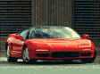 | 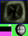 |  |  |
| ` 112×83 ` | ` 56×72 ` | ` 208×83 ` | ` 72×40 ` |

---

### [📁 CDIAB](CDIAB/README.md)
* **Total Images:** 12 images
* **Total Size:** 44 KB

#### Quick Preview:
| **CDIAB.BIC.png** | **CDIAB.ETC.png** | **CDIAB.ICN.png** | **CDIAB.SIC.png** |
|  :---:  |  :---:  |  :---:  |  :---:  |
|  |  |  |  |
| ` 112×83 ` | ` 56×72 ` | ` 208×83 ` | ` 72×40 ` |

---

### [📁 CMYTH](CMYTH/README.md)
* **Total Images:** 12 images
* **Total Size:** 53.7 KB

#### Quick Preview:
| **CMYTH.BIC.png** | **CMYTH.ETC.png** | **CMYTH.ICN.png** | **CMYTH.SIC.png** |
|  :---:  |  :---:  |  :---:  |  :---:  |
|  |  |  |  |
| ` 112×83 ` | ` 56×72 ` | ` 208×83 ` | ` 72×47 ` |

---

### [📁 CSTEL](CSTEL/README.md)
* **Total Images:** 12 images
* **Total Size:** 47.5 KB

#### Quick Preview:
| **CSTEL.BIC.png** | **CSTEL.ETC.png** | **CSTEL.ICN.png** | **CSTEL.SIC.png** |
|  :---:  |  :---:  |  :---:  |  :---:  |
|  | 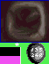 | 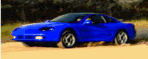 |  |
| ` 112×83 ` | ` 56×72 ` | ` 208×83 ` | ` 72×40 ` |

---

### [📁 DATAA](DATAA/README.md)
* **Total Images:** 16 images
* **Total Size:** 107 KB

#### Quick Preview:
| **ACCO.LZ.png** | **BROKE.LZ.png** | **BROKEGA.LZ.png** | **CHASE.LZ.png** |
|  :---:  |  :---:  |  :---:  |  :---:  |
|  | 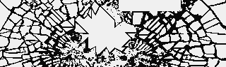 | 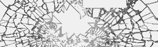 |  |
| ` 320×200 ` | ` 320×96 ` | ` 320×96 ` | ` 496×32 ` |

---

### [📁 DATAB](DATAB/README.md)
* **Total Images:** 12 images
* **Total Size:** 95.5 KB

#### Quick Preview:
| **COPA.LZ.png** | **COPB.LZ.png** | **COPSEQ.LZ.png** | **DIFFLEVA.LZ.png** |
|  :---:  |  :---:  |  :---:  |  :---:  |
|  |  | 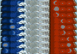 |  |
| ` 320×100 ` | ` 320×58 ` | ` 128×90 ` | ` 320×56 ` |

---

### [📁 DATAC](DATAC/README.md)
* **Total Images:** 3 images
* **Total Size:** 2.9 KB

#### Quick Preview:
| **COMPASS.LZ.png** | **DETAIL1.LZ.png** | **DETAIL2.LZ.png** |
|  :---:  |  :---:  |  :---:  |
|  |  |  |
| ` 152×8 ` | ` 184×5 ` | ` 184×5 ` |

---

### [📁 palette](palette/README.md)
* **Total Images:** 4 images
* **Total Size:** 65.5 KB

#### Quick Preview:
| **cape_cod_map1.png** | **pacific_yosemite_map1.png** | **pacific_yosemite_map2_rain.png** | **pacific_yosemite_map2.png** |
|  :---:  |  :---:  |  :---:  |  :---:  |
| 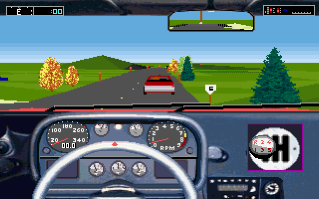 | 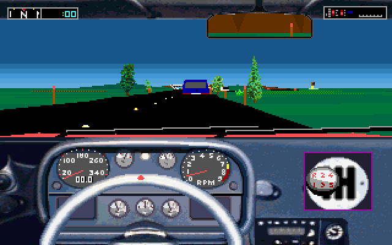 | 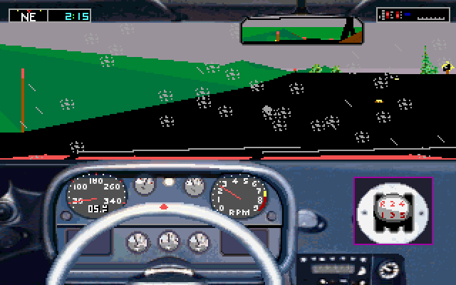 | 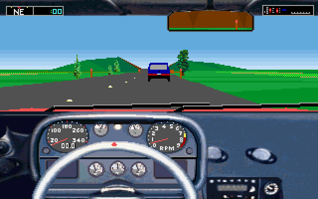 |
| ` 640×400 ` | ` 640×400 ` | ` 640×400 ` | ` 640×400 ` |

---

### [📁 SCENE01](SCENE01/README.md)
* **Total Images:** 8 images
* **Total Size:** 38.2 KB

#### Quick Preview:
| **SCENE01_0x0_320x33.png** | **SCENE01_0x1e5a2_320x50.png** | **SCENE01_0x29a_72x40.png** | **SCENE01_0x124c9_320x50.png** |
|  :---:  |  :---:  |  :---:  |  :---:  |
|  | 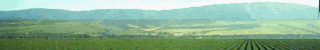 |  |  |
| ` 320×33 ` | ` 320×50 ` | ` 72×40 ` | ` 320×50 ` |

---

### [📁 SCENE01_SPRITES](SCENE01_SPRITES/README.md)
* **Total Images:** 128 images
* **Total Size:** 128.5 KB

#### Quick Preview:
| **sprite_0x1a9_r02_v02_1x1.png** | **sprite_0x1a64_r14_v00_6x4.png** | **sprite_0x1aaf_r15_v00_6x4.png** | **sprite_0x1afa_r16_v00_2x1.png** |
|  :---:  |  :---:  |  :---:  |  :---:  |
|  |  |  |  |
| ` 1×1 ` | ` 6×4 ` | ` 6×4 ` | ` 2×1 ` |

---

### [📁 SCENE02](SCENE02/README.md)
* **Total Images:** 8 images
* **Total Size:** 36.7 KB

#### Quick Preview:
| **SCENE02_0x0_320x33.png** | **SCENE02_0x2a649_320x50.png** | **SCENE02_0x2bd_72x40.png** | **SCENE02_0x2c962_320x19.png** |
|  :---:  |  :---:  |  :---:  |  :---:  |
|  |  |  |  |
| ` 320×33 ` | ` 320×50 ` | ` 72×40 ` | ` 320×19 ` |

---

### [📁 SCENE02_SPRITES](SCENE02_SPRITES/README.md)
* **Total Images:** 110 images
* **Total Size:** 108.3 KB

#### Quick Preview:
| **sprite_0x1a90_r18_v10_22x36.png** | **sprite_0x1c7_r02_v12_1x1.png** | **sprite_0x1d6_r02_v15_2x1.png** | **sprite_0x1ded_r18_v11_27x42.png** |
|  :---:  |  :---:  |  :---:  |  :---:  |
|  |  |  |  |
| ` 22×36 ` | ` 1×1 ` | ` 2×1 ` | ` 27×42 ` |

---

### [📁 SCENETT1_SPRITES](SCENETT1_SPRITES/README.md)
* **Total Images:** 128 images
* **Total Size:** 128.5 KB

#### Quick Preview:
| **sprite_0x1a9_r02_v02_1x1.png** | **sprite_0x1a64_r14_v00_6x4.png** | **sprite_0x1aaf_r15_v00_6x4.png** | **sprite_0x1afa_r16_v00_2x1.png** |
|  :---:  |  :---:  |  :---:  |  :---:  |
|  |  |  |  |
| ` 1×1 ` | ` 6×4 ` | ` 6×4 ` | ` 2×1 ` |

---

*Generated automatically by Antigravity AI on 2026-05-23.*
